# **Integrating Blender in a Production Environment**

`How do we integrate Blender in our Pipeline?`

While there are thousands of tutorials out there on how to do this or achieve that in Blender there are hardly any talking about how to use Blender in a Production Pipeline. But for Studios wanting to integrate Blender, this is almost the first question that needs an answer.

There is not really an official document that gives an overview about this topic. So it is time to start a repository to cover the frequently asked questions. Ideally this should be a shared knowledge base that grows over time. I strongly encourage everyone to contribute to this document. The goal of this document should be to give TDs an overview on how to get started integrating Blender in a Pipeline. It will contain useful links, explanations and tools that make your life easier!

This document should not be a duplication of the existing documentation but rather a glossary tailored to the question above which will then point to relevant sections of the Blender documentation. It will still provide explanations about topics that are not documented very well or contain best practices that are not known to new users.

## **Table of Contents**
- [Starting Blender](#starting-blender)
    - [Command Line Arguments](#command-line-arguments)
    - [Environment Variables](#environment-variables)
- [Qt](#qt)
- [Data handling](#data-handling)
    - [Datablocks](#datablocks)
    - [Fake User](#fake-user)
    - [Datablocks IO](#datablocks-io)
    - [Libraries](#libraries)
    - [Libraries Python Automation](#libraries-python-automation)
- [Python](#python)
    - [Python Api](#python-api)
    - [Addons](#addons)
    - [Scripts](#scripts)
    - [Handlers](#handlers)
    - [Properties](#properties)
        - [ID Properties](#id-properties)
        - [Type Properties](#type-properties)
        - [Window Manager Properties](#window-manager-properties)
    - [UI](#ui)
    - [Third-Party Python Libraries](#third-party-python-libraries)
- [Operators](#operators)
    - [Built in Functions](#operator-functions)
    - [Built in Properties](#built-in-operator-properties)
    - [Calling from Python](#calling-operators-from-python)
    - [Naming Conventions](#operator-naming-conventions)
    - [Finding Operators in Source Code](#finding-operators-in-blender-source-code)
    - [Context Override](#context-override)
    - [Operator vs bpy.data](#operator-vs-bpydata)
- [Overrides](#overrides)
    - _TODO_
- [Workflows](#workflows)
    - _TODO_
- [IO](#io)
    - _TODO_
- [Developer Tips](#development)
    - [Developer Preferences](#developer-preferences)
    - [Copy Data Path](#copy-data-path)
    - [Code Editor](#code-editor)
    - [Outliner](#outliner-data-api-view)
- [Community](#community)
- [How to Contribute](#how-to-contribute)

<!-- "Auto Run Python Scripts"
"publishing and versioning what’s the best approach"
"workflows: animation caching yes or no"
"setting up library assets"
"actions and animations"
"overrides" (https://code.blender.org/2022/02/overrides-workshop/)
"blender libraries, relinking"
"BAT" -->

## **Starting Blender**

### **Command Line Arguments**

You can start Blender with several [Command Line Arguments](https://docs.blender.org/manual/en/latest/advanced/command_line/arguments.html).

Please check this link for a more detailed explanation of all the flags.

**Some useful examples:**

- Start Blender and execute a python script on startup
    ```
    blender --python /path/to/script.py
    ```

- Start Blender with list of add-ons enabled in addition to default add-ons
    ```
    blender --addons studio_pipeline,render_farm,blender_kitsu
    ```

- Start Blender allowing Python to use system environment variables such as `PYTHONPATH` (by default Blender ignores that variable).
    ```
    blender --python-use-system-env
    ```
- Start Blender but skip processing the Blender user config and scripts directory. Useful to debug if user configuration (addons, startup scripts) is source of error.
    ```
    blender --factory-startup
    ```

- Render .blend file in the background to relative output path, specifying frame counter and output format. Use whole frame range and add file extension to path.
    ```
    blender -b shot.blend -o //render/shot_###### -F OPEN_EXR_MULTILAYER  -x 1 -a
    ```

### **Environment Variables**

Blender has a very limited range of built int environment variables that control certain aspects.

You can find a list of the available environment variables at the bottom of this page:

[Environment Variables](https://docs.blender.org/manual/en/latest/advanced/command_line/arguments.html#environment-variables)

One of the most important environment variable you are going to use is:

`BLENDER_USER_SCRIPTS`

If you worked with other DCCs this variable is similar to `HOUDINI_PATH` or `MAYA_SCRIPT_PATH`.

`BLENDER_USER_SCRIPTS` is a directory location in which Blender searches for all kinds of files and sub folders to configure the Blender session that is starting up.

To learn more about the directory structure of the `BLENDER_USER_SCRIPTS` folder please refer to:

[Blender’s Directory Layout](https://docs.blender.org/manual/en/latest/advanced/blender_directory_layout.html)


> **_In a Pipeline:_**: If you have some sort of software starter at your Studio you can use this variable to supply Artists with some add-ons, start-up scripts and other things that your studio or project requires.

> **_Note:_** `BLENDER_USER_SCRIPTS` is a single path. Blender does not support a list of search paths yet like you might be used to from other DCCs. Many Pipelines do like to have a directory path for Studio wide tools and scripts and at least another one for only project specific stuff. This is not possible currently. You will need to find a way to work around it.

> **_Note:_** Setting `BLENDER_USER_SCRIPTS` results in Users not having their personal add-ons and scripts available that Blender normally loads from a sub path in the users home directory (See: [Blender’s Directory Layout](https://docs.blender.org/manual/en/latest/advanced/blender_directory_layout.html)). Be aware of that.

## **Qt**

Many Studios use [Qt](https://www.qt.io/) to built UIs for their tools.
As many DCCs actually use Qt themselves, integrating custom Interfaces with some Qt Python binding is usually quite straightforward.

Blender has it's own UI Framework (openGL and soon Vulkan & Metal backend) and therefore has no Qt Integration out of the box.

But it's still possible to run your Qt Interfaces without blocking Blender. Many people have solved this problem, please refer to the following links for some example solutions:

- [Blender Pyside2 Example](https://github.com/friedererdmann/blender_pyside2_example)
- [bqt](https://github.com/techartorg/bqt) (Starts Blender inside of a Qt Window)
- [Blender Shotgrid Integration](https://github.com/diegogarciahuerta/tk-blender/blob/d2c21fa53ab861886858388fbdc115e6d4e10a9d/resources/scripts/startup/Shotgun_menu.py#L90)
- [Blender Avalon Integration](https://gitlab.com/jasperges/avalon-core/-/blob/add-blender28-support/avalon/blender/ops.py)

It basically comes down to starting your own Qt Event Loop and process it's events in a modal operator.
To learn more about modal operators refer to this link:

[Modal Operators](https://docs.blender.org/api/current/bpy.types.Operator.html#modal-execution)

<!-- TODO: Add note about difficulties working with current Context and QT, to rather work with bpy.data -->

## **Data Handling**

### **Datablocks**

Understanding roughly how a .blend file is structured will help you a lot to understand how to handle data in Blender.

You can think of a .blend file a little like a database.

It is composed of [data blocks](https://docs.blender.org/manual/en/latest/files/data_blocks.html) each storing different kinds of data. And these data blocks can reference each other creating some sort of hierarchy.

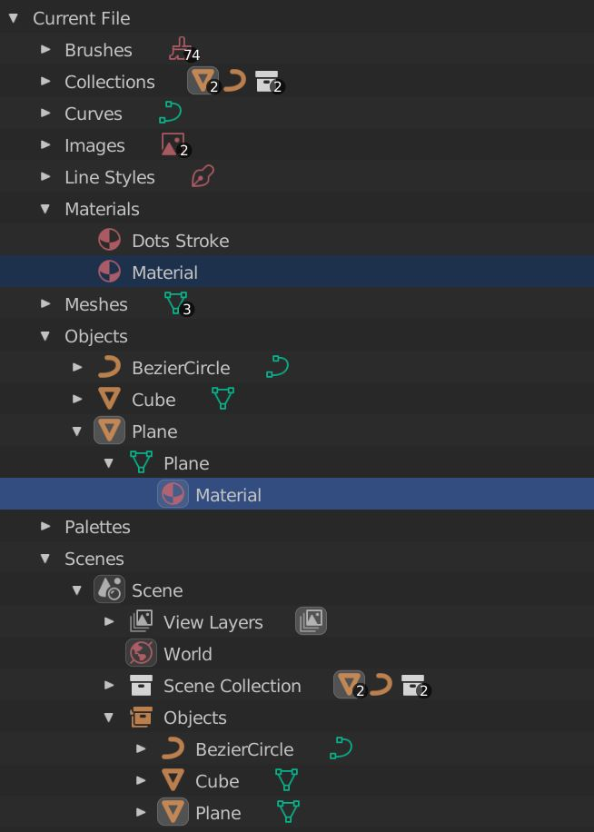

>**_Tipp:_** This view is available in the Blender Outliner if you switch the display type to: **Blender File**

If you want get in to detail on how a .blend file is built on the C level read this [article](https://www.foro3d.com/f232/article-mystery-of-the-blend-77413.html) by [Jeroen Bakker](https://developer.blender.org/p/jbakker/).

### **Fake User**

The concept of the `Fake User` is something that always leads to confusion for people that are new to Blender.

As illustrated in the previous chapter, a `.blend` file contains datablocks. As soon as a datablock is referenced by something, it has a user. If you create a new material and assign it to one object, the material has `1` user: the object.

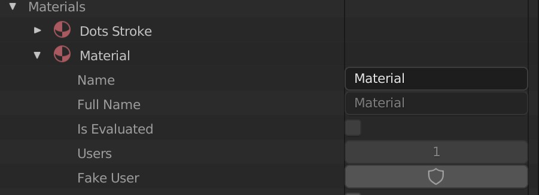

As soon as you close a .blend file, Blender deletes all datablocks that have `0` users. It is essentially a garbage collector to keep your .blend file clean and tidy.

While this can be a nice feature, it can also be confusing if you don't know about it.

What if you still want to keep a datablock even if it is not referenced by something?

You assign a fake user to it. That prevents Blender from deleting the datablock when closing down the file. It is especially important when building up libraries of Materials, Actions or any other data type without having to reference them by something.

You can do this via the UI:

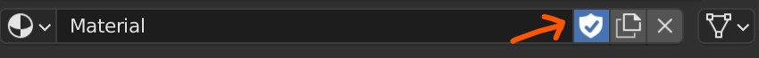


Or the Python API:
```python
>>> bpy.data.materials['Material'].use_fake_user = True
```

### **Datablocks IO**

[Datablocks](https://docs.blender.org/manual/en/latest/files/data_blocks.html) can be:
-  **linked** (live / referenced) or
- **appended** (imported / copied)

from other .blend files. This [article](https://docs.blender.org/manual/en/latest/files/linked_libraries/link_append.html) documents these two operations in more detail.


<p float="left">
    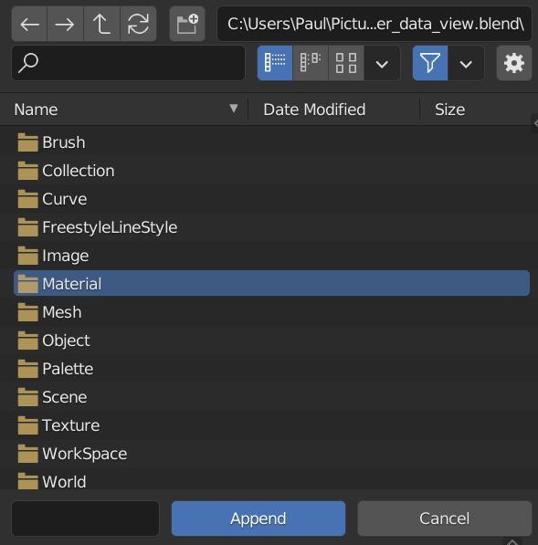
    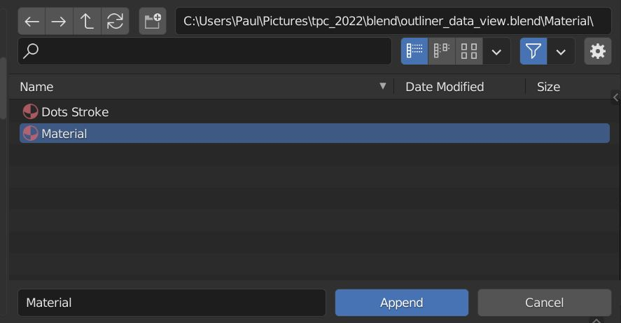
</p>

These two operations will be the back bone for any data going from one .bend file to another.

It is a good idea to make use of linking or appending in any IO situation in which no other software is involved. Of course Blender also supports Alembic, FBX, USD and other formats but importing native Blender data works the best and doesn't loose data (custom properties etc).

#### **Libraries**

Once you link a datablock from another .blend file that .blend file will be referenced as a [Library](https://docs.blender.org/api/current/bpy.types.Library.html).

To check which libraries and what datablocks from those libraries are loaded in your blend file go to the `Blender File` category of the Outliner.

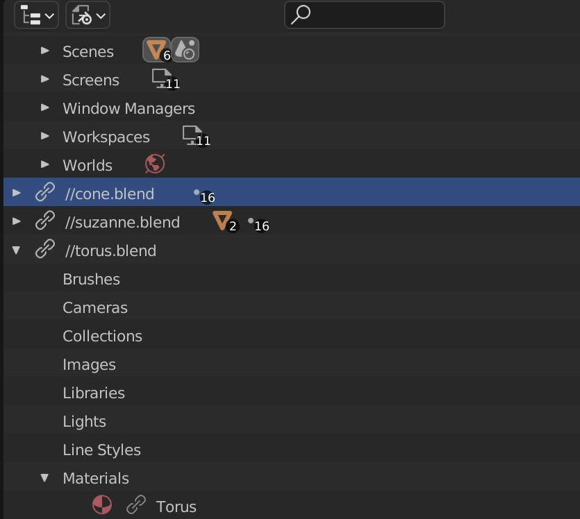

A [Library](https://docs.blender.org/api/current/bpy.types.Library.html) itself is actually a datablock. To examine it's properties go the `Data API` category or the outliner.


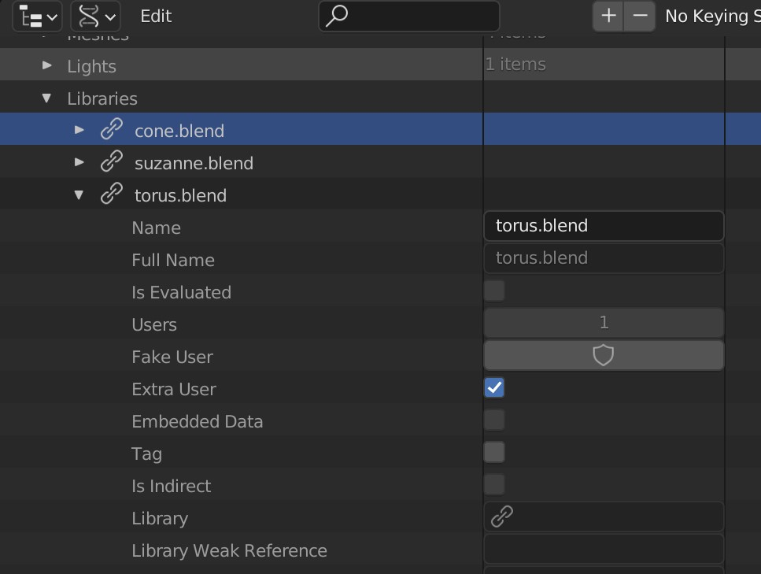

You can also access the loaded libraries via the Python API:

```python
>>> bpy.data.libraries
```

---

As in other software packages you can change the file to which that library points to.

>**_In a Pipeline:_**: When a new publish of an asset was made and you want to change the path of the library to point to the latest version.

To achieve this, right click on the library in the `Blender File` view of the Outliner and execute the [Relocate](https://docs.blender.org/api/current/bpy.ops.wm.html#bpy.ops.wm.lib_relocate) operator.

You will then be prompted with a file dialog to set the new path of the library.

Blender then replaces all the linked datablocks from the old library with the ones from the new library and tries to retain any overrides you made in the current file.


Relocating can also be done via the Python API.

To do so it is recommended to call the Operator:

```python
from pathlib import Path

lib = bpy.data.libraries["my_asset_v001"]
new_lib_path = Path("/path/to/my_asset_v002.blend")

bpy.ops.wm.lib_relocate(
    library=lib.name,
    directory=new_lib_path.parent.as_posix(),
    filename=new_lib_path.name,
)
```

In theory you could also do it like this:

```python
lib = bpy.data.libraries["my_asset_v001"]
lib.filepath = "/path/to/my_asset_v002.blend"
lib.reload()
```
But I experienced unstable behavior and therefore rather call the Operator.

#### **Libraries Python Automation**

In a Pipeline IO operations are usually automated.
Blenders Python API provides useful functions for that which are also documented in the [BlendDataLibraries](https://docs.blender.org/api/current/bpy.types.BlendDataLibraries.html) section.

Below are some examples to **write** datablocks to another .blend file with Python:

```python
import bpy

filepath = "//new_library.blend"

# write selected objects and their data to a .blend file
data_blocks = set(bpy.context.selected_objects)
bpy.data.libraries.write(filepath, data_blocks)


# write all meshes starting with a capital letter and
# set them with fake-user enabled so they aren't lost on re-saving
data_blocks = {mesh for mesh in bpy.data.meshes if mesh.name[:1].isupper()}
bpy.data.libraries.write(filepath, data_blocks, fake_user=True)


# write all materials, textures and node groups to a library
data_blocks = {*bpy.data.materials, *bpy.data.textures, *bpy.data.node_groups}
bpy.data.libraries.write(filepath, data_blocks)
```

---

**Loading** data blocks from another .blend file works a little bit different. For that you can use:

```python
with bpy.data.libraries.load(filepath) as (data_from, data_to):
    # data_from is a representation of bpy.data of the external file
    # data_to is a representation of bpy.data of the current file

    # except for actual blender type objects the attributes are just lists of strings
    # e.G data_from.objects: List[str] -> ["Suzanne", "Cube", "Cone", "my_object", ...]
    scene_names_from_external_lib = data_from.scenes # bpy.data.scenes
    object_names_from_external_lib = data_from.objects # bpy.data.objects
    object_names_current_file = data_to.objects
```

It returns a context manager which exposes 2 library objects on entering.
The first one is from the external library (`data_from`) the second one represents the current .blend file (`data_to`).


>**_Note:_**: The variables have to be named `data_from` and `data_to`


Both of those library objects are a representation of `bpy.data` of each library.
But the attributes e.G `data_from.objects` are not actual blender type objects but a list of strings.

And to load an object called `Suzanne` from the external library to the current file, you can just append it to:
`data_to.objects`:

```python
# Import the object "Suzanne" that is in data_from.objects
with bpy.data.libraries.load(filepath) as (data_from, data_to):
    data_to.objects = ["Suzanne"]
```
>**_Note:_**: This only works if the object `Suzanne` also exists in data_from.objects

Here are some more useful examples that are also included in the link above:

```python
import bpy

filepath = "//link_library.blend"

# load a single scene we know the name of.
with bpy.data.libraries.load(filepath) as (data_from, data_to):
    data_to.scenes = ["Scene"]


# load all meshes
with bpy.data.libraries.load(filepath) as (data_from, data_to):
    data_to.meshes = data_from.meshes


# link all objects starting with 'A'
with bpy.data.libraries.load(filepath, link=True) as (data_from, data_to):
    data_to.objects = [name for name in data_from.objects if name.startswith("A")]


# append everything
with bpy.data.libraries.load(filepath) as (data_from, data_to):
    for attr in dir(data_to):
        setattr(data_to, attr, getattr(data_from, attr))


# the loaded objects can be accessed from 'data_to' outside of the context
# since loading the data replaces the strings for the datablocks or None
# if the datablock could not be loaded.
with bpy.data.libraries.load(filepath) as (data_from, data_to):
    data_to.meshes = data_from.meshes
# now operate directly on the loaded data
for mesh in data_to.meshes:
    if mesh is not None:
        print(mesh.name)

```

## **Python**

### **Python-Api**

Blender has a built in Python API. You can find the official documentation here:

[Blender Python API Documentation](https://docs.blender.org/api/current/index.html)

Make sure to read the [Quickstart](https://docs.blender.org/api/current/info_quickstart.html), [Overview](https://docs.blender.org/api/current/info_overview.html), [Gotchas](https://docs.blender.org/api/current/info_gotcha.html) and [Tips and Tricks](https://docs.blender.org/api/current/info_tips_and_tricks.html) on that page. They will get you started.

A great video series to get started with scripting in Blender is [Scripting for Artists](https://www.youtube.com/watch?v=sOS2ID1ZN3A&list=PL1fkRtMmJ4OOrY20bOVlxn_PFYx9ly97j) by [Sybren Stüvel](https://stuvel.eu/).

### Addons

The most common way to expose your Python scripts and tools to Artists is through a Blender add-on. It's very easy and straightforward to create one. Add-ons can then be enabled and disabled in the user's preferences.

In the beginning it might seem annoying to create a whole add-on for some simple functions, but you will quickly realize, that it is worth it.

Please refer to this guide here that walks you through the whole process of creating an add-on:

[Addon Tutorial](https://docs.blender.org/manual/en/latest/advanced/scripting/addon_tutorial.html)

You will notice that Blender offers a very powerful way with its add-on architecture for custom extension.

### **Scripts**

At any time you can also just create or open Python scripts in the Text Editor. From the Text Editor you can run these scripts and quickly prototype that way.

Another useful feature are **startup scripts**. To add a script that runs on startup just place it in the blender configuration directory at this subpath:

`./scripts/startup/*.py`

Refer to [Blender’s Directory Layout](https://docs.blender.org/manual/en/latest/advanced/blender_directory_layout.html) if you are unsure where that is.

---

It's good to know that by default Blender does not automatically execute Python scripts. You have to specifically enable it in a [setting](https://docs.blender.org/manual/en/latest/advanced/scripting/security.html#setting-defaults) in the Preferences.


If a script wants to execute but `Auto Run Python Scripts` is disabled, you will be warned with a pop-up.

Check out the [Scripting & Security](https://docs.blender.org/manual/en/latest/advanced/scripting/security.html) section for more information.

---

A not very well known feature is that you can enable "register" text data blocks. Which means they will get run when the .blend file is loaded.


This is a technique often used by riggers to build UIs for their rig with Python.

To make sure that this text datablock comes with the rig on **link/append**, you can just create a reference to it in a custom property:

```python
>>> rig.data['script'] = bpy.data.texts['myscript.py']
```

Speaking of properties, let's have a look at them in the next section.


### **Handlers**

Many DCCs offer hooks to add execution of custom scripts on certain events (on scene load, on post save, frame change, etc).

In Blender you can do all of that with [Handlers](https://docs.blender.org/api/current/bpy.app.handlers.html). Make sure to click on the link and check on what kind of Events you can register handlers.

To add a very basic handler that is always executed on `scene load` you can do this:

```python
import bpy
from bpy.app.handlers import persistent


@persistent
def load_handler(dummy):
    # Set default scene settings:
    bpy.context.scene.render.resolution_x = 2048
    bpy.context.scene.render.resolution_y = 858

bpy.app.handlers.load_post.append(load_handler)
```

>**_Note:_**: By default handlers are freed when loading new files, in some cases you may want the handler stay running across multiple files (when the handler is part of an add-on for example). The `@persistent` decorator can be used for that.

---

It's good practice to also remove handlers in the `unregister()` function of your add-on.

A usual setup looks like this:

```python
def register():
    bpy.app.handlers.load_post.append(load_handler)

def unregister():
    bpy.app.handlers.load_post.remove(load_handler)
```

---

A not so well known type of handlers are `Draw Handlers`. You can add them to subclasses of [Spaces](https://docs.blender.org/api/current/bpy.types.Space.html).

A draw handler gets executed every time that `Space` is re-drawn (which is 60 times per second on most monitors).

>**_Note:_**: Blender only draws parts of the UI on demand. For example when the mouse is over an `Area` or when the dependency graph triggers an update.

Blender has a whole Python wrapper library to draw your custom UIs directly with openGL.

Check out the documentation of the [GPU Module](https://docs.blender.org/api/current/gpu.html). A very interesting rabbit hole to get lost in.

The [draw.py](https://developer.blender.org/diffusion/BSTS/browse/master/blender-kitsu/blender_kitsu/sqe/draw.py) module of the `blender-kitsu` add-on adds custom color lines on top of video sequence editor strips to indicate a global 'Sequence' that they belong to:


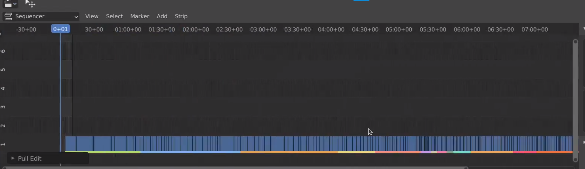

---

>**_Hack:_**: If you want to force a certain setting to be "unchangeable" by Artists you can abuse draw handlers as a hack.

```python

draw_handlers_fb: List[Callable] = []

def enforce_asset_import_type_handler(_):
    area = bpy.context.area
    # Options: ["LINK", "APPEND", "APPEND_REUSE"]
    if area.spaces.active.params.import_type != "LINK":
        area.spaces.active.params.import_type = "LINK"

def register():
    global draw_handlers_fb
    # Region types: ['HEADER', 'TOOLS', 'TOOL_PROPS', 'WINDOW']
    handler = bpy.types.SpaceFileBrowser.draw_handler_add(
            enforce_asset_import_type_handler, (None,), "HEADER", "POST_PIXEL"
        )
    draw_handlers_fb.append(handler)
```

### **Operators**

Operators are a core concept in Blender. Every button you can click in the Blender UI is an Operator. Most of them are defined in the `C` code. It is also possible to register new Operators with Python. You can think of them as a interface between your code and Blender. This is how you can expose your python code in the Blender UI and make it accessible for Users.

Operators have 3 main functions that you will spend most time working with. There are also others but let's focus on those first.

Let's look at an example of a very basic Operator.

For the sake of testing the following script also exposes the Operator in a new Panel in the 3D Viewport.

```python
import bpy
from pprint import pprint

from typing import Set

class wm_OT_print_context(bpy.types.Operator):
    bl_idname = "wm.print_context"
    bl_label = "Print Context"
    bl_description = "Prints the current context in the Python console"

    my_attr: bpy.props.BoolProperty()

    @classmethod
    def poll(cls, context: bpy.types.Context) -> bool:
        print("Poll is running")
        return True

    def execute(self, context: bpy.types.Context) -> Set[str]:
        # context.copy() creates dictionary out of Context object
        context_dict = context.copy()
        pprint(context_dict)
        return {"FINISHED"}

    def invoke(self, context, event):
        self.report({"INFO"}, "Invoke is running")
        return self.execute(context)

class wm_PT_test_panel(bpy.types.Panel):
    bl_label = "Print Context"
    bl_space_type = "VIEW_3D"
    bl_region_type = "UI"

    def draw(self, context):
        row = self.layout.row()
        op = row.operator("wm.print_context")

bpy.utils.register_class(wm_PT_test_panel)
bpy.utils.register_class(wm_OT_print_context)
```

>**_Note:_** Paste this snippet in the Blender script editor and execute it. Make sure to then run the Operator in the "Print Context" Panel in the 3D Viewport on the right side. Have a look at the Python console!

#### **Operator Functions:**

- **poll**: Check if Operator can run. Always runs first, if it returns `False` Operator won't run. If the poll fails the operator will also be greyed out in the UI. Notice that if the Operator is exposed in a UI Panel the poll function will be executed every time the panel is redrawn. So the check here should not be too complex.

<!-- TODO: Note about cls.test_attr can't be queried in poll function -->

- **execute**:
The execute function is the main function of the Operator. It is always being executed when calling an Operator from the UI or by Python (by default).
It needs to return a `Set` that contains a Literal. Common values are:
    - "CANCELLED"
    - "FINISHED"

        For a full list refer [this](https://docs.blender.org/api/current/bpy.ops.html#calling-operators) link.


- **invoke**:
The invoke function is used to initialize the operator from the context at the moment the operator is called. If an Operator is called from the UI the invoke function is being executed by default. It is usually used to initialize certain values of the Operator. So make sure if you reimplement invoke to also call execute at the end.
The invoke function also has access to the [Event](https://docs.blender.org/api/current/bpy.types.Event.html) object, which contains further information how the Operator was called (mouse position, etc).

#### **Built in Operator Properties:**

- **bl_idname**:
Has to be a unique ID. Meaning no 2 Operators can share the same bl_idname. This ID is also being used in other places. For example when exposing an Operator in the UI the string value of bl_idname is used: `row.operator("wm.print_context")`.

- **bl_label**: Is the default Label that is being displayed when exposing an Operator in the UI.

- **bl_description**: Is the description text being displayed in the pop-up when users hover over an Operator in the UI.

Besides of those Properties you can aso define:

- **bl_options**: A set of Literals. Please refer to [Operator Type Flag Items](https://docs.blender.org/api/current/bpy_types_enum_items/operator_type_flag_items.html#rna-enum-operator-type-flag-items) for a full list of options. With those flags you can control if an Operator for example should be un-doable, show up in a operator search results and more.

#### **Calling Operators from Python**

When registering an Operator with `bpy.utils.register_class()` the `bl_idname` class attribute indicates the "address" of the operator.

Examples:

- `bl_idname = "wm.print_context"`
--> bpy.ops.wm.print_context()

- `bl_idname = "my_namespace.print_context"`
--> bpy.ops.my_namespace.print_context()

It needs to contain `1` dot and the prefix is essentially the namespace under which the operator will be registered.

---

A not very well known feature is that when calling an operator via Python you can pass additional arguments to it.

Remember the `invoke` function only being called when an Operator is executed from the UI?

The [Execution Context](https://docs.blender.org/api/current/bpy.ops.html#execution-context) of an Operator can be changed by passing a positional argument as a string. Common options are:
- `"INVOKE_DEFAULT"`
- `"EXEC_DEFAULT"`

For a full list refer to the link above.

```python
bpy.ops.wm.print_context("INVOKE_DEFAULT")
```

Would make sure to call the `invoke` function of the Operator even tough, it is called by Python.

```python
bpy.ops.wm.print_context("EXEC_DEFAULT")
```
Calls the `execute` function, which is default behavior via Python anyways.

---

But what if you want to expose an Operator in the UI and force it to call `execute` instead of the `invoke`?

That can be done with a setting that is stored on `bpy.types.UILayout`. With our panel from earlier it would look like that:

```python
class wm_PT_test_panel(bpy.types.Panel):
    bl_label = "Print Context"
    bl_space_type = "VIEW_3D"
    bl_region_type = "UI"

    def draw(self, context):
        row = self.layout.row()

        # From now on `execute` is called for operators
        self.layout.operator_context = "EXEC_DEFAULT"
        op = row.operator("wm.print_context")

        # Switch back to invoke default behavior
        self.layout.operator_context = "INVOKE_DEFAULT"
        op = row.operator("wm.print_context")
```

#### **Operator Naming Conventions**

You probably already noticed that the Operator classes in the example have an interesting naming schema.

It is advised to follow the schema otherwise you get warnings in the Python console and it is good practice after all. The sames goes for `Panels`, `Menus` and other classes by the way.

The easiest way to understand is starting from the `bl_idname` attribute.

For our example Operator it was:

```python
bl_idname = "wm.print_context"
```

Therefore the class of our Operator should be called:

```python
wm_OT_print_context()
```

The namespace `wm` before the dot goes to the beginning of the class name. Then we have the type of class which is `OT` for `Operator`. Last but not least the actual name of the Operator `print_context`.

#### **Finding Operators in Blender Source Code**

We can also apply this principle the other way around. Let's say we want to find an Operator in the Blender source code, because we want look up why the `poll()` function fails.

To find the Operator:
```python
bpy.ops.object.material_slot_add()
```

We should search for:

```
object_OT_material_slot_add
```

And as you can see it is defined with that name in [render_shading.cc](https://github.com/blender/blender/blob/master/source/blender/editors/render/render_shading.cc#:~:text=void%20OBJECT_OT_material_slot_add\(wmOperatorType,%7D).

#### **Context Override**

As we already saw earlier when defining our own Operators, all the functions have a `context`
argument.

The context contains a lot of information that Operators often read.

For example the Operator `bpy.ops.object.material_slot_add()` adds a new material slot to the object that is being worked on. And which object that is, is stored in the context.

Refer to [Context Access](https://docs.blender.org/api/current/bpy.context.html) to get an overview of what can be in there or use our Operator we built in the previous [section](#operators).


Often when calling an operator via Python you will get the error:

```
[...].poll() failed, context is incorrect
```

This means the Operator can't find certain information in the `context` argument.

To check what keys the Operator expects, it is sometimes useful to know how to find the Operator in the actual Blender source code, as there is not really another way to find out.

---

Let's say we want to add a new material slot to an object via Python.

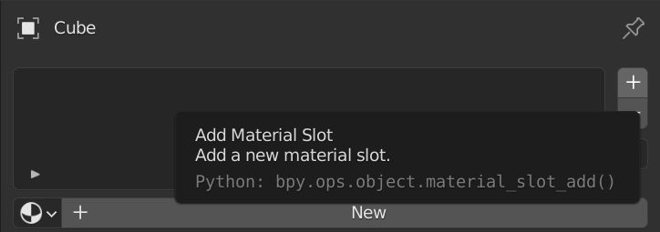


If we type:

```python
bpy.ops.object.material_slot_add()
```
in the Python shell we get the poll() failed, context is incorrect error.

Let's try to find the Operator in the C code.

With what we learned in the [Finding Operators in Blender Source Code](#finding-operators-in-blender-source-code) chapter we should search for:

```
object_OT_material_slot_add
```

And we can find the definition of that Operator in [render_shading.cc](https://github.com/blender/blender/blob/master/source/blender/editors/render/render_shading.cc#:~:text=void%20OBJECT_OT_material_slot_add\(wmOperatorType,%7D) (`source/blender/editors/render/render_shading.cc`).

Let's check what the `ot->poll` function is.

```c
static bool object_materials_supported_poll(bContext *C)
{
  Object *ob = ED_object_context(C);
  return object_materials_supported_poll_ex(C, ob);
}
```

If we then jump to `ED_object_context` we can see that a key called "object" is being retrieved from `Context`. So that is what the Operator expects to find. If the key does not exist, or the key does not hold a valid value, the poll function will fail.

```c
Object *ED_object_context(const bContext *C)
{
  return CTX_data_pointer_get_type(C, "object", &RNA_Object).data;
}
```

So far so good. We found out what our Operator expects to find in the context object, but how can we supply the Operator with that information if it's not present or if we want to override it?

We do a so called [Context Override](https://docs.blender.org/api/current/bpy.ops.html#overriding-context).

That way the Operator acts on our specified data rather than the one normally contained in the context.

```python

with bpy.context.temp_override(object=bpy.data.objects["Cube"])
    bpy.ops.object.material_slot_add()
```

As you can see we successfully added a material slot to the "Cube" object, even tough we called it from the Python shell.


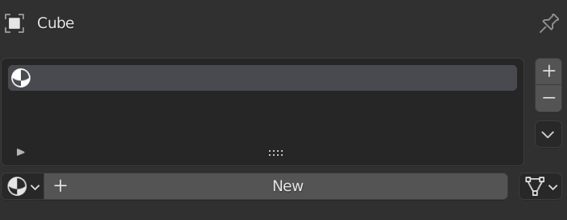

---

The legacy way of doing a context_override was to pass a dictionary as first positional argument:

```python
bpy.ops.object.material_slot_add({"object": bpy.data.objects["Cube"]})
```

The official documentation on [Overriding Context](https://docs.blender.org/api/current/bpy.ops.html#overriding-context) can also be found here.

#### Operator vs bpy.data

Adding a material slot to an object with Python can also be done without calling an Operator.

In fact many things in Blender can be done without having to call Operators but rather doing them directly via `bpy.data`.

This is in general a **very** good practice to follow as Operators have some issues:

- They just return a Set with info about their exit state
- They rely on information in the `context` and often it's hard to find out what that information is

Let's look at the example from the [previous](#context-override) chapter and try to solve it in another way.

To add a new empty material slot to an object we can do it directly with:

```python
bpy.data.objects['Cube'].data.materials.append(None)
```

Another example would be to create a new material. It is as simple as:

```python
material = bpy.data.materials.new("my_material")
```

And the great thing is it returns the newly created material as opposed to the operator `bpy.ops.material.new()`.

### **Properties**

Sooner or later you will run in scenarios in which you deal with some custom data, be it some asset attributes that your pipeline requires or really any arbitrary data that you want to save on something in your .blend file.

In Blender this can be done through [Properties](https://docs.blender.org/api/current/bpy.props.html).

Custom properties can be added to any subclass of an `ID`, `Bone` and `PoseBone`.

How you create a custom property, depends on the scenario, which is why it can be a little bit confusing for beginners. As there is not a really a resource out there that explains properties in detail, this section will receive some extra attention.

#### **ID Properties**

Let's say you have the object `Suzanne` in your scene and you want to add some metadata on it. It as easy as doing this:

```python
>>> bpy.data.objects["Suzanne"]["fruit"] = "Banana"
```

> **_Note:_** We use [] notation here to assign a value to the key 'fruit' as you would do with dictionaries


Notice that in the object properties panel you will find `fruit` showing up under the `Custom Properties` tab. So the command above is essentially the same as using the `bpy.ops.wm.properties_add()` operator that you can find at the top of the tab.


Checking out the type, returns `str` as expected.

```python
>>> type(bpy.objects["Suzanne"]["fruit"])
str
```

---

Let's try out some different data types.

```python
>>> bpy.data.objects["Suzanne"]["favorite_fruits"] = ["Banana", "Coconut", "Mango"]
```


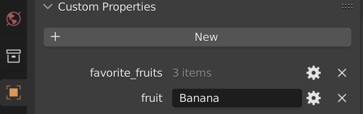

Let's see what `type()` returns:

```python
>>> type(bpy.objects["Suzanne"]["favorite_fruits"])
<list>
```

Notice if the data type was a list containing only strings Blender shows it as 'N Items' in the UI. But we can still edit the value if we press the gear icon:


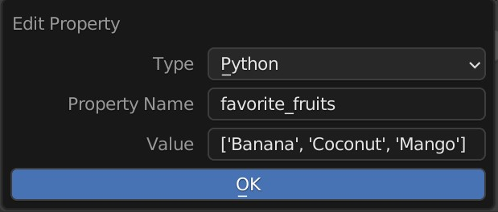

Als notice the type is declared as `Python`.

---

Instead of using an array of strings let's try what happens when we use as an array of floats.


```python
>>> bpy.data.objects["Suzanne"]["favorite_floats"] = [1.0, 2.0, 3.0]
```

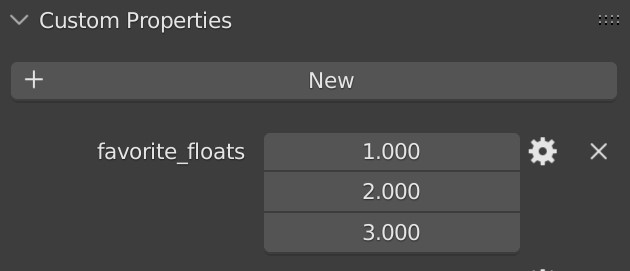

Notice that Blender seems to be able to display a `FloatArray` integrated in the UI.

Let's check what `type()` returns:

```python
>>> type(bpy.objects["Suzanne"]["favorite_numbers"])
<class 'IDPropertyArray'>
```

Interesting! You might have expected to get `list` as we did before.

Also note another thing. If we click the gear icon we can now select a data `Subtype`. Let's select color. Blender now display the float array as a color gizmo.


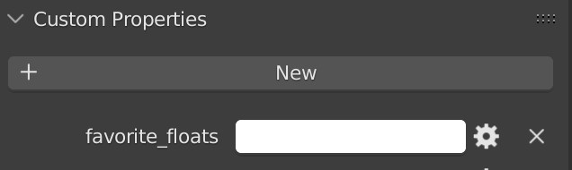


It is **important** to understand that if the data type matches a certain structure, Blender converts it to a built in type that supports additional features (subtype, display in the UI, ...). If you want to know exactly what's going down skim through the [source code](https://github.com/blender/blender/blob/master/source/blender/python/intern/bpy_rna.c#L7506).


---

Last but not least let's try what happens when we assign a dictionary as value:


```python
>>> bpy.data.objects["Suzanne"]["shopping_list"] = {"Banana": 99, "Apples": 2, "Coconuts": 42}
```

Let's see what `type()` returns:

```python
>>> type(bpy.objects["Suzanne"]["shopping_list"])
<class 'IDPropertyGroup'>
```

Dictionaries are converted to the IDPropertyGroup type. You can still get the dictionary with:

```python
>>> bpy.objects["Suzanne"]["shopping_list"].to_dict()
```

You can read more about the `IDPropertyGroup` and `IDPropertyArray` type [here](https://docs.blender.org/api/current/idprop.types.html#idprop.types.IDPropertyGroup).

---

#### **Type Properties**

But what if we want to have a property that is registered on all Objects. Maybe an attribute `for_export` that is either `True` or `False` and controls if this object should be exported by our custom studio exporter.

Rather than registering our property on a single object we will register it on the `Object` type like so:

```python
>>> bpy.types.Object.for_export = False
```

Notice that we are using the dot notation here, as we are essentially adding a new class attribute to the class `Object`. Using brackets `[]` would throw an error here.

If we now select any Object in our scene and check the custom properties tab, you will notice nothing is there.

But if we still try to get that new property:

```python
>>> bpy.data.objects["Suzanne"].for_export
False
```

We get the default value we used when initializing it.

Let's set the property to something else than it's default value:

```python
>>> bpy.data.objects["Suzanne"].for_export = True
AttributeError: 'Object' object attribute 'for_export' is read-only
```

That doesn't work, as it is marked as `read-only`. But we still want to be able to change that.

---

When we want to add new properties on a whole type we should use a class that is in the `bpy.props` module. You can find all supported data types [here](https://docs.blender.org/api/current/bpy.props.html).

Let's try that again with:

```python
>>> bpy.types.Object.for_export = bpy.props.BoolProperty(default=False)
```
We can now also change the value of that property for one object:

```python
>>> bpy.data.objects["Suzanne"].for_export = True
```

It is generally advised to work with the properties in the `bpy.props` module because they can do a lot more really useful things!

For example we can define a subtype when we initialize the property, give it a name and a description that will be displayed when users hover over it with their mouse.

```python
>>> bpy.types.Object.export_path = bpy.props.StringProperty(
    name="Export Path",
    description="Output path when export script will be executed",
    subtype="FILE_PATH"
)

```

Because we specified `subtype="FILE_PATH"` if the property is displayed in the UI it will have a little browse file icon next to it and if you press it users can navigate to a file through the Blender File Browser. The property then gets the filepath of the selected file assigned.

That way we can also not change the property value to another type by accident:

```python
>>> bpy.context.active_object.export_path = 2
TypeError: bpy_struct: item.attr = val: Object.export_path expected a string type, not int
```

---

A very powerful feature is that we can also assign callback functions that are executed when the property is modified, when it gets written or read.

```python

def my_callback(self, context):
    print(f"Value got updated to: {self.export_path}")

bpy.types.Object.export_path = bpy.props.StringProperty(
    name="Export Path",
    description="Output path when export script will be executed",
    subtype="FILE_PATH",
    update=my_callback,
)
```

Try it out an see what happens.

---

> **_Note:_** When registering properties on types with the dot notation don't start to access or set these properties with brackets (object["export_path"]) after that. Otherwise this can get confusing for you and Blender.

>**_In a Pipeline_**: you would usually create those properties in the registering section of your add-on. That way you can ensure that those properties exist and your add-on can work with them. Try to solve as much as possible with the built-in properties of the `bpy.props` module and register them on a whole type.

Check out the [props.py](https://developer.blender.org/diffusion/BSTS/browse/master/blender-kitsu/blender_kitsu/props.py) module of the blender-kitsu add-on to see an example how this can look.

Please refer to the [Property Definitions](https://docs.blender.org/api/current/bpy.props.html) section of the documentation if you want to learn more about this topic.

#### **Annotated Properties**

In Blender we can register a range of Blender type classes ourselves with:

```python
bpy.utils.register_class()
```
Some of those Blender type classes are:

```
bpy.types.Header
bpy.types.KeyingSetInfo
bpy.types.Menu
bpy.types.Operator
bpy.types.Panel
bpy.types.PropertyGroup
bpy.types.RenderEngine
bpy.types.UIList
```

Those classes can also contain custom properties. But the way we register custom properties on those classes works a little bit different.

Let's have a look at a common example: an [Operator](https://docs.blender.org/api/current/bpy.types.Operator.html). Often you want to supply some input to an Operator and execute logic depending on it.

We can define a custom property on an Operator like so:

```python
import bpy
from typing import *

class my_OT_custom_operator(bpy.types.Operator):
    bl_idname = "my.custom_operator"
    bl_label = "Custom Operator"

    # Define custom property with an Annotation, using : instead of =
    filepath: bpy.props.StringProperty(name="File Path", subtype="FILE_PATH")

    def execute(self, context: bpy.types.Context) -> Set[str]:

        # Get filepath and do something
        filepath = self.filepath
        print(f"Doing something with this filepath: {self.filepath}")

        # Return
        return {"FINISHED"}

# Unregister if already registered
try:
    bpy.utils.unregister_class(my_OT_custom_operator)
except:
    pass

# Register
bpy.utils.register_class(my_OT_custom_operator)

```

And now we can do the following in a the interactive Python console:

```python
>>> bpy.ops.my.custom_operator(filepath="/tmp/test.txt")
Doing something with this filepath: /tmp/test.txt
{'FINISHED'}
```
Pretty cool!

So notice that we have to only annotate these properties as class attributes (with types of `bpy.props`). Internally when registering this class Blender actually checks the:

```
Class.__annotations__
```

attribute and grabs the annotated properties from there. When you try to initialize a class attribute like so:

```python
class my_OT_custom_operator(bpy.types.Operator):
    ...
    # = instead of :
    filepath = bpy.props.StringProperty(name="File Path", subtype="FILE_PATH")
```

You might run in to errors and the class won't register.

> **_Note:_** That you can actually pass a value for the `filepath` property of our Operator as a key word argument in Python is some special magic that is done by Blender when registering Operators.


> **_Note:_** Operators are a very powerful concept, you can learn more about them in the official [Operator](https://docs.blender.org/api/current/bpy.types.Operator.html) section of the documentation.


---

But the annotation rule is the same for a `PropertyGroup` for example:

```python
import bpy

class MyPropertyGroup(bpy.types.PropertyGroup):

    # Annotate the properties we want
    my_float: bpy.props.FloatProperty(name="Some Floating Point")
    my_bool: bpy.props.BoolProperty(name="Toggle Option")
    my_string: bpy.props.StringProperty(name="String Value")

# First register our PropertyGroup class
bpy.utils.register_class(MyPropertyGroup)

# Then actually create a new property the scene type that 'points'
# to our PropertyGroup
bpy.types.Scene.my_settings = bpy.props.PointerProperty(type=MyPropertyGroup)

```
You can now access `my_float` like so:

```python
>>> bpy.context.scene.my_settings.my_float
0.0
```
Property Groups are very useful to, as the name says, 'group' multiple properties together. You can also nest them in to each other.

>**_In a Pipeline_**: you would usually register one property group on the required type and store all your properties inside that group to keep things nice and tidy!


#### **Window Manager Properties**

The [window manager](https://docs.blender.org/api/current/bpy.types.WindowManager.html) is a Blender data block that defines open windows and other user interface data. Because of it's nature that it is always newly created for a Blender session it offers Python scripts a great place to store very temporary data that will be scrapped when the session ends.

To add a property to the window manager do:

```python
>>> bpy.context.window_manager["temp_prop"] = 123
```

This property will be gone when you open a new .blend file or reload the current one.

### **UI**

People completely new to Blender might not be aware of it so it's worth mentioning that the entire Blender UI is actually defined in Python. That means not only can you use Python to create you own UIs for Blender, you can even modify the existing one and fit it to the need of your Studio without touching any C code.

If you have enabled the `Developer Extras` option in the Preferences (Interface Tab) you can actually right click on any UI item and select `Edit Source`. This will open the python file in Blender the text editor and jump to the line that is responsible for that Element. Really useful!

---

You will run in situations in which you have to interact with UI Elements/Parts of Blender. For that it is really useful to roughly know how the Windowing System in Blender works.

You can get started by reading the [User Interface](https://docs.blender.org/manual/en/latest/interface/index.html) of the documentation.

In general Blenders UI is composed of [Windows](https://docs.blender.org/api/current/bpy.types.Window.html), [Screens](https://docs.blender.org/api/current/bpy.types.Screen.html), [Areas](https://docs.blender.org/manual/en/latest/interface/window_system/areas.html), [Spaces](https://docs.blender.org/api/current/bpy.types.Space.html#bpy.types.Space) and [Regions](https://docs.blender.org/manual/en/latest/interface/window_system/regions.html).

I can recommend to dig through the `Data API` view of the Outliner to understand how they relate to each other.

You can also play around with the Python API:

```python
bpy.data.window_managers['WinMan'].windows[0].screen.areas[0].regions[0].type
```

---

Sometimes it can be useful to force Blender to redraw it's UI. You can achieve that with this function:

```python
def redraw_ui() -> None:
    """Forces blender to redraw the UI."""
    for screen in bpy.data.screens:
        for area in screen.areas:
            area.tag_redraw()
```
### **Third-party Python Libraries**

If your add-on or your studio pipeline requires some third party Python libraries that are not shipped with Blender Python there are a couple of approaches to solve this issue.

In general it is good to know that you can find the Python binary that Blender ships with if you type this command in to Blenders interactive Python console:

```python
>>> import sys
>>> sys.executable
/path/to/blenders/python
```

#### **Copy Python library to ./scripts/addons/modules**

On startup Blender adds the directory `./scripts/addons/modules` to `sys.path`. This path is relative to the standard local user configuration folder.
You can just copy the Python library in that folder.

>**_Note:_** Can be overwritten by `$BLENDER_USER_SCRIPTS`.

If you are unsure where that is refer to [Blender Directory Layout](https://docs.blender.org/manual/en/latest/advanced/blender_directory_layout.html)


#### **Virtual Environment & PYTHONPATH**

One approach can be to create a virtual environment with the blender Python binary and install the library with pip:

```bash
./python -m venv /path/to/venv

source /path/to/venv/bin/activate

pip3 install library
```

Then set the **PYTHONPATH** variable to the site-packages directory of your virtual environment.

```bash
export PYTHONPATH="$PYTHONPATH:/path/to/venv/lib/python3.10/site-packages"
```

And finally start Blender with the `--python-use-system-env` argument (otherwise PYTHONPATH will be ignored).

```bash
/path/to/blender --python-use-system-env
```

#### **Dynamically load wheel files**

Another approach can be to ship the library with your add-on.

The [Blender Cloud Add-on](https://developer.blender.org/diffusion/BCA/repository/master/) has built an example approach to do this.

Check out [this](https://developer.blender.org/diffusion/BCA/browse/master/blender_cloud/wheels/__init__.py) module of the Blender Cloud Add-on that can load external dependencies which are packaged in wheel files.

#### **Add Libraries to Blender installation**

Another way that you will see more often in the internet is that people directly install a library in the Blender installations site-packages directory. I personally don't prefer that approach as I like to keep the Installation clean and untouched.

To do this navigate to the Python binary that ships with Blender.

Make sure pip is available:

```python
./python -m ensurepip
```

Install the library with pip:

```python
./python -m pip install library
```

## **Developer Tips**

#### **Developer Preferences**

If you develop tools for Blender make sure to enable `Developer Extras` and `Python Tooltips` in your Preferences.


#### **Copy Data Path**

You often want to adjust some properties when writing Python scripts for Blender. To find out how to actually change a property with python, right click on the property and select `Copy Full Data Path` which copies the data path of the property to the clipboard.


You can also do it the other way around.
Open a Info Editor and change any property or perform an action. You will see the action being printed out as a Python command in the Info Editor. Very useful!

#### **Code Editor**

If you are going to integrate Blender in your pipeline you will be writing your first add-on or script sooner or later. In order to make your life easier consider using the following tools:

- [fake-bpy-module](https://github.com/nutti/fake-bpy-module): Is a python package that mimics the Blender Python API so you can have code completion in your IDE. Simply install it with: `pip install fake-bpy-module-latest
`

- [Blender Development VSCode Extension](https://marketplace.visualstudio.com/items?itemName=JacquesLucke.blender-development): Really useful extension for Visual Studio Code to make Blender development easier. One of the most important aspect is that it attaches a debugger and you can set breakpoints in your Python code.

#### **Outliner Data API View**

While the interactive python console provides some pretty good autocomplete it is sometimes useful to be able to browse through a data structure in a tree view.
The **Data API** view of the Blender Outliner provides exactly that. It's super handy to get a quick overview what properties exist.

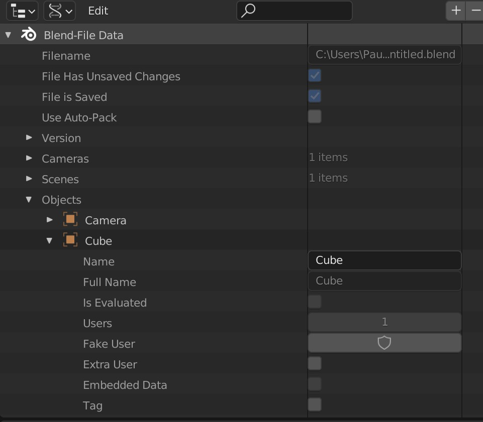

## **Community**

Blender has a huge community and you can find help in a lot of places. The most important pages are:

- [developer.blender.org](https://developer.blender.org/): Phabricator front end that actually tracks the whole Blender development. Here you can find all open tasks, planned features, modules and their projects and open bug reports. This is the place to check out if you want to know in real time what's being worked on. **_Note:_** Will soon move to [Gitea](https://code.blender.org/2022/07/gitea-diaries-part-1/)

- [devtalk.blender.org](https://devtalk.blender.org/): This is a dedicated place for Blender module teams to reach out to contributors and the community. It's a good place to start discussions and ask questions in dedicated thread. You will also find reports of regular meetings amongst the developers. One of the most exciting ones to check out is the [weekly report](https://devtalk.blender.org/c/blender/weekly-updates) what changed in Blender.

- [blender.chat](https://blender.chat/): One of the most important pages to hang around and get help quickly. This is the official chat platform. It has dedicated [channels](https://blender.chat/directory/channels) for each module. You can think about this like your Studio Slack channel except everything is open. Even all the developers communicate publicly there, it's a great place to be.

- [righclickselect](https://blender.community/c/rightclickselect): This is the place to make feature requests for Blender. Share your idea with the community. Discuss it. Revise it.


## **How to Contribute**

This document should be a shared knowledge base so I strongly encourage everyone to contribute to it.

I want to highlight this section of the introduction again:

> _The goal of this document should be to give TDs an overview on how to get started integrating Blender in a Pipeline. This document should not be a duplication of the existing documentation but rather a glossary tailored to the question above which will then point to relevant sections of the Blender documentation. It will still provide explanations about topics that are not documented very well or contain best practices that are not known to new users._


If you have an idea for a new section, want to share your knowledge or found a mistake please make use of the [Issues](https://github.com/paulgolter/blender-pipeline-integration/issues) list of this repository. As this is only a single document it makes sense to validate first that other people aren't already working on the same topic.

So please create an issue for a topic that you are interested to write for.
