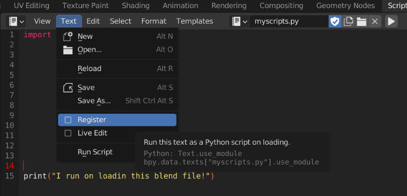
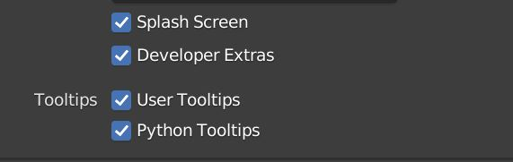

# Integrating Blender in a Production Environment

Hey all. In the last year or so I had several discussions about the question:

`How do we integrate Blender in our Pipeline?`

While there are thousands of tutorials out there on how to do this or achieve that in Blender there are hardly any talking about how to use Blender in a Production Pipeline. But for Studios wanting to integrate Blender, this is almost the first question that needs an answer.

There is not really an official document somewhere that gives you an overview. So I though it's time to start a little repository to cover the frequently asked questions. Ideally this should be shared knowledge base that grows over time. I strongly encourage everyone to contribute to this document. The goal of this document should be to give TDs an overview on how to get started integrating Blender in a Pipeline. You will find useful links, tips and tools that make your life easier!

## Table of Contents
- [Starting Blender](#starting-blender)
    - [Command Line Arguments](#command-line-arguments)
    - [Environment Variables](#environment-variables)
- [Qt](#Qt)
- [Python](#python)
    - [Python Api](#python-api)
    - [Addons](#addons)
    - [Scripts](#scripts)
    - [Properties](#properties)
    - [UI](#ui)
    - [Handlers](#handlers)
    - [Third-party python modules](#third-party-python-modules)
- [Developer Tips](#development)
- [Data handling](#data-handling)
    - [Datablocks](#datablocks)
    - [Fake User](#fake-user)
- [IO](#io)
- [Community](#community)

<!-- "Auto Run Python Scripts"
"how to make sure python scripts that comes with blender files are executed eg"
"publishing and versioning what’s the best approach"
"workflows: animation caching yes or no"
"fake user"
"setting up library assets"
"actions and animations"
"overrides" (https://code.blender.org/2022/02/overrides-workshop/)
"blender libraries, relinking"
"BAT" -->

## Starting Blender

### Command Line Arguments

You can start Blender with several [Command Line Arguments](https://docs.blender.org/manual/en/latest/advanced/command_line/arguments.html).

Please check this link for a more detailed explanation of all the flags.

**Some useful examples:**

- Start Blender and execute a python script on startup
    ```
    blender --python /path/to/script.py
    ```

- Start Blender with list of add-ons enabled in addition to default add-ons
    ```
    blender --addons studio_pipeline,render_farm,blender_kitsu
    ```

- Start Blender allowing Python to use system environment variables such as `PYTHONPATH` (by default Blender ignores that variable).
    ```
    blender --python-use-system-env
    ```
- Start Blender but skip processing the Blender user config and scripts directory. Useful to debug if user configuration (addons, startup scripts) is source of error.
    ```
    blender --factory-startup
    ```

- Render .blend file in the background to relative output path, specifying frame counter and output format. Use whole frame range and add file extension to path.
    ```
    blender -b shot.blend -o //render/shot_###### -F OPEN_EXR_MULTILAYER  -x 1 -a
    ```

### Environment Variables

Blender has a very limited range of built int environment variables that control certain aspects.

You can find a list of the available environment variables at the bottom of this page:

[Environment Variables](https://docs.blender.org/manual/en/latest/advanced/command_line/arguments.html#environment-variables)

One of the most important environment variable you are going to use is:

`BLENDER_USER_SCRIPTS`

If you worked with other DCCs this variable is similar to `HOUDINI_PATH` or `MAYA_SCRIPT_PATH`.

`BLENDER_USER_SCRIPTS` is a directory location in which Blender searches for all kinds of files and sub folders to configure the Blender session that is starting up.

To learn more about what you can configure please refer to:

[Blender’s Directory Layout](https://docs.blender.org/manual/en/latest/advanced/blender_directory_layout.html)


If you have some sort of software starter at your Studio you can use this variable to supply Artists with some add-ons, start-up scripts and other things that your studio or project requires.

> **_NOTE:_** `BLENDER_USER_SCRIPTS` is a single path. Blender does not support a list of search paths yet like you might be used to from other DCCs. Many Pipelines do like to have a directory path for Studio wide tools and scripts and at least another one for only project specific stuff. This is not possible currently. You will need to find a way to work around it.

> **_NOTE:_** Setting `BLENDER_USER_SCRIPTS` results in Users not having their personal add-ons and scripts available that Blender normally loads from a sub path in the users home directory (See: [Blender’s Directory Layout](https://docs.blender.org/manual/en/latest/advanced/blender_directory_layout.html)). Be aware of that.

## Qt

Many Studios use [Qt](https://www.qt.io/) to built UIs for their tools.
As many DCCs actually use Qt themselves, integrating custom Interfaces with some Qt Python binding is usually quite straightforward.

Blender has it's own UI Framework (openGL and soon Vulkan & Metal backend) and therefore has no Qt Integration out of the box.

But it's still possible to run your Qt Interfaces without blocking Blender. Many people have solved this problem, please refer to the following links for some example solutions:

- [Blender Pyside2 Example](https://github.com/friedererdmann/blender_pyside2_example)
- [bqt](https://github.com/techartorg/bqt) (Starts Blender inside of a Qt Window)
- [Blender Shotgrid Integration](https://github.com/diegogarciahuerta/tk-blender/blob/d2c21fa53ab861886858388fbdc115e6d4e10a9d/resources/scripts/startup/Shotgun_menu.py#L90)
- [Blender Avalon Integration](https://gitlab.com/jasperges/avalon-core/-/blob/add-blender28-support/avalon/blender/ops.py)

It basically comes down to starting your own Qt Event Loop and process it's events in a modal operator.
To learn more about modal operators refer to this link:

[Modal Operators](https://docs.blender.org/api/current/bpy.types.Operator.html#modal-execution)

## Python

### Python-Api

Blender has a built in Python API. You can find the official documentation here:

[Blender Python API Documentation](https://docs.blender.org/api/current/index.html)

Make sure to read the introduction articles and gotchas on that page. They will get you started quickly.

A great video series to get started with scripting in Blender is [Scripting for Artists](https://www.youtube.com/watch?v=sOS2ID1ZN3A&list=PL1fkRtMmJ4OOrY20bOVlxn_PFYx9ly97j) by [Sybren Stüvel](https://stuvel.eu/).
### Addons

The most common way to expose your Python scripts and tools to Artists is through a Blender add-on. It's very easy to create a Blender add-on with Python that can be then enabled and disabled in the user's preferences.

Please refer to this guide here that walks you through the whole process of creating an add-on:

[Addon Tutorial](https://docs.blender.org/manual/en/latest/advanced/scripting/addon_tutorial.html)

You will notice that Blender offers a very powerful way with its add-on architecture for custom extension.

### Scripts

At any time you can create or open Python scripts in the Text Editor. From the Text Editor you can also run these scripts and quickly prototype that way.

Another useful feature are startup scripts. To add a script that runs on startup just place them in the blender configuration directory at this subpath:

`./scripts/startup/*.py`

Refer to [Blender’s Directory Layout](https://docs.blender.org/manual/en/latest/advanced/blender_directory_layout.html) if you are unsure where that is.


A not very well known feature is that you can enable "register" text data blocks. Which means they will get run when the blend file is loaded.



This is a technique often used by riggers to build UIs for their rig with Python.

To make sure that this text datablock comes with the rig on link/append, you can just create a reference to it in a custom property:

```python
rig.data['script'] = bpy.data.texts['myscript.py']
```

Speaking of properties, let's have a look at them in the next section.

### Properties

Sooner or later you will run in scenarios in which you deal with some custom data, be it the current shot name, some asset attribute or something else that you want to save on something in your blend file.

In Blender this can be done through [Properties](https://docs.blender.org/api/current/bpy.props.html).

There are many different types of properties that you can can find at the bottom of the link above. Some of them include:

- `BoolProperty`
- `CollectionProperty`
- `EnumProperty`
- `FloatProperty`
- `StringProperty`
- `IntProperty`
- ...

Let's say you have the object `Suzanne` in your scene and you want to add some metadata on it. It as easy as doing this:

```
bpy.objects["Suzanne"]["fruit"] = "Banana"
```

Notice that in the object properties panel you will find `my_prop` showing up under the `Custom Properties` tab. So the command above is essentially the same as using the `bpy.ops.wm.properties_add()` operator that you can find at the top of the tab.

Let's try out some different data types.

```
bpy.objects["Suzanne"]["shopping_list"] = {"Banana": 99, "Apples": 2, "Coconuts": 42}
```

Cool so even dictionaries are supported.

But what if we want to have a property that is registered on all Objects?

We then have to register it on:

`bpy.types.Object.


Let's check:

 `type(bpy.objects["Suzanne"]["shopping_list"])`

--> `<class 'IdPropertyGroup'>`

You will notice it's not `dict` but part of some `IdProperties`.
<!-- TODO: Add image  -->


### UI

People completely new to Blender might not be aware of it so it's worth mentioning that the entire Blender UI is actually defined in Python. That means not only can you use Python to create you own UIs for Blender, you can even modify the existing one and fit it to the need of your Studio without touching any C code.

If you have enabled the `Developer Extras` option in the Preferences (Interface Tab) you can actually right click on any UI item and select `Edit Source`. This will open the python file in Blender the text editor and jump to the line that is responsible for that Element. Really useful!

## Developer Tips
If you develop tools for Blender make sure to enable `Developer Extras` and `Python Tooltips` in your Preferences.



---

You often want to adjust some properties when writing Python scripts for Blender. To find out how to actually change a property with python, right click on the property and select `Copy Full Data Path` which copies the data path of the property to the clipboard.


You can also do it the other way around.
Open a Info Editor and change any property or perform an action. You will see the action being printed out as a Python command in the Info Editor. Very useful!

---

If you are going to integrate Blender in your pipeline you will be writing your first add-on or script sooner or later. In order to make your life easier consider using the following tools:

- [fake-bpy-module](https://github.com/nutti/fake-bpy-module): Is a python package that mimics the Blender Python API so you can have code completion in your IDE. Simply install it with: `pip install fake-bpy-module-latest
`

- [Blender Development VSCode Extension](https://marketplace.visualstudio.com/items?itemName=JacquesLucke.blender-development): Really useful extension for Visual Studio Code to make Blender development easier. One of the most important aspect is that it attaches a debugger and you can set breakpoints in your Python code.

## Community

Blender has a huge community and you can find help in a lot of places. The most important pages are:

- [developer.blender.org](https://developer.blender.org/): Phabricator front end that actually tracks the whole Blender development. Here you can find all open tasks, planned features, modules and their projects and open bug reports. This is the place to check out if you want to know in real time what's being worked on. **_NOTE:_** Will soon move to [Gitea](https://code.blender.org/2022/07/gitea-diaries-part-1/)

- [devtalk.blender.org](https://devtalk.blender.org/): This is a dedicated place for Blender module teams to reach out to contributors and the community. It's a good place to start discussions and ask questions in dedicated thread. You will also find reports of regular meetings amongst the developers. One of the most exciting ones to check out is the [weekly report](https://devtalk.blender.org/c/blender/weekly-updates) what changed in Blender.

- [blender.chat](https://blender.chat/): One of the most important pages to hang around and get help quickly. This is the official chat platform. It has dedicated [channels](https://blender.chat/directory/channels) for each module. You can think about this like your Studio Slack channel except everything is open. Even all the developers communicate publicly there, it's a great place to be.

- [righclickselect](https://blender.community/c/rightclickselect): This is the place to make feature requests for Blender. Share your idea with the community. Discuss it. Revise it.
